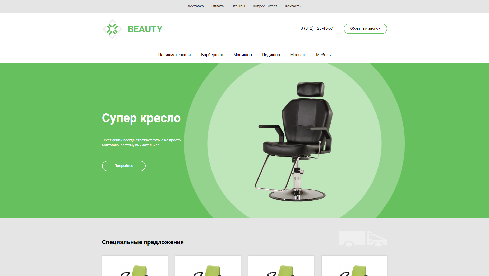

# Beauty

📄 **beauty** - это проект пластилин, который слеплен из моих остаточных знаний о веб-разработке. Так же являлся первой практикой [в верстке из Figma](https://www.figma.com/file/V3l3zWEuVqixPQzeWw34AI/Templates-HTML%2FCSS?node-id=0%3A1&viewport=380%2C527%2C0.3488253355026245), сделан по макету [Типичного Верстальщика - Анны Блок](https://www.youtube.com/channel/UCn5wduCq2Mus0v85QZn9IaA).

## about:

📑 Для наименования классов верстки использовался **BEM**. Для **CSS3** использовался его препроцессор **SASS**, с синтаксисом **SCSS**. Проект задумывался как простая песочница для практики.

- 📝 Краткий очерк по проделанной работе:
  - Написать чистый и структурно ясный код, с использованием методологии;
  - Вспомнить азы **SCSS**, применить основной функционал для лучшей читаемости;
  - Использовать весь изученный ранее материал от _Flex-контейнеров_, вплоть до _Grid_;
  - Применить _responsive-adaptive layout_ и реализовать ее с разными форматами _display_;

---

## warning:

> 📌 _Работа над проектом прекращена:_
>
> > **beauty** _- это простенький проект для практики в верстке._
>
> **P.s.** _миленько и без лишних наворотов ~_

---

<h1 align="center"><a href="https://lapard1n.github.io/beauty">beauty:</a></h1>

---
